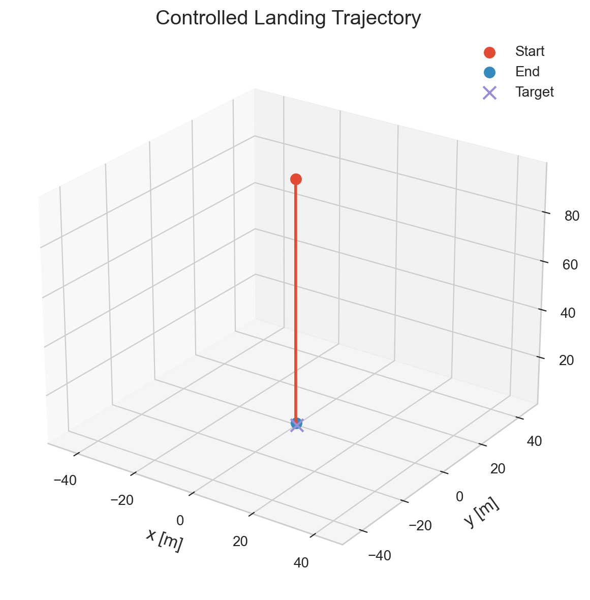
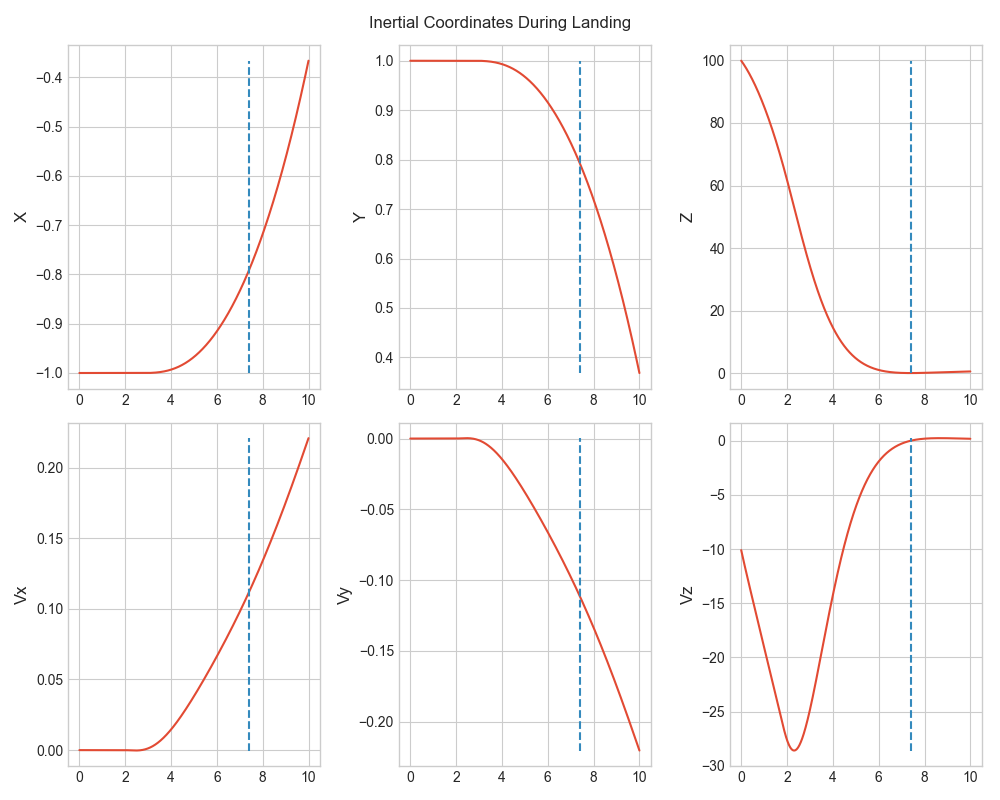
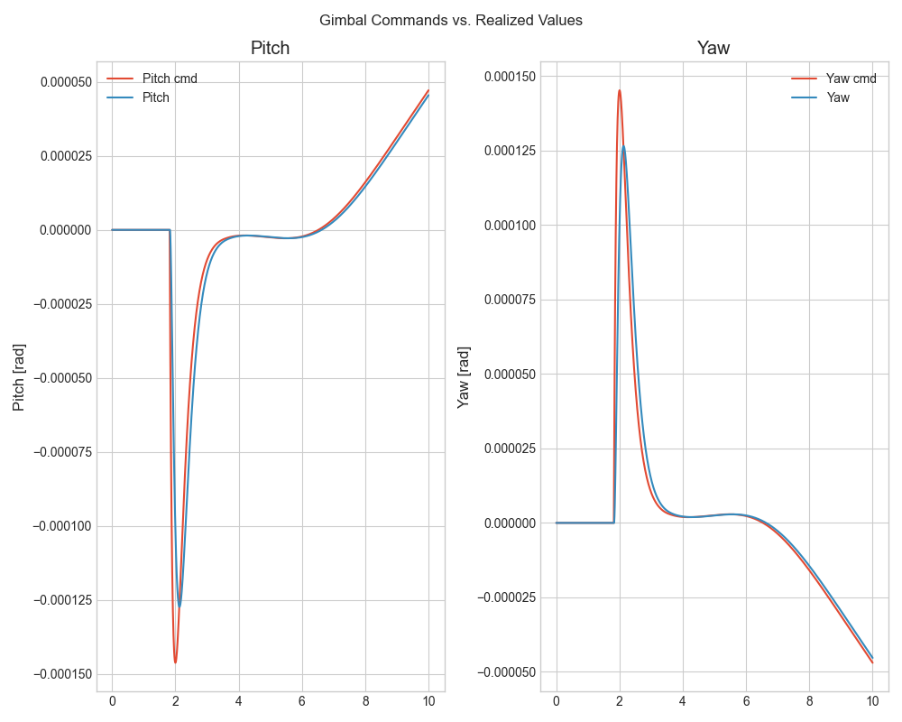
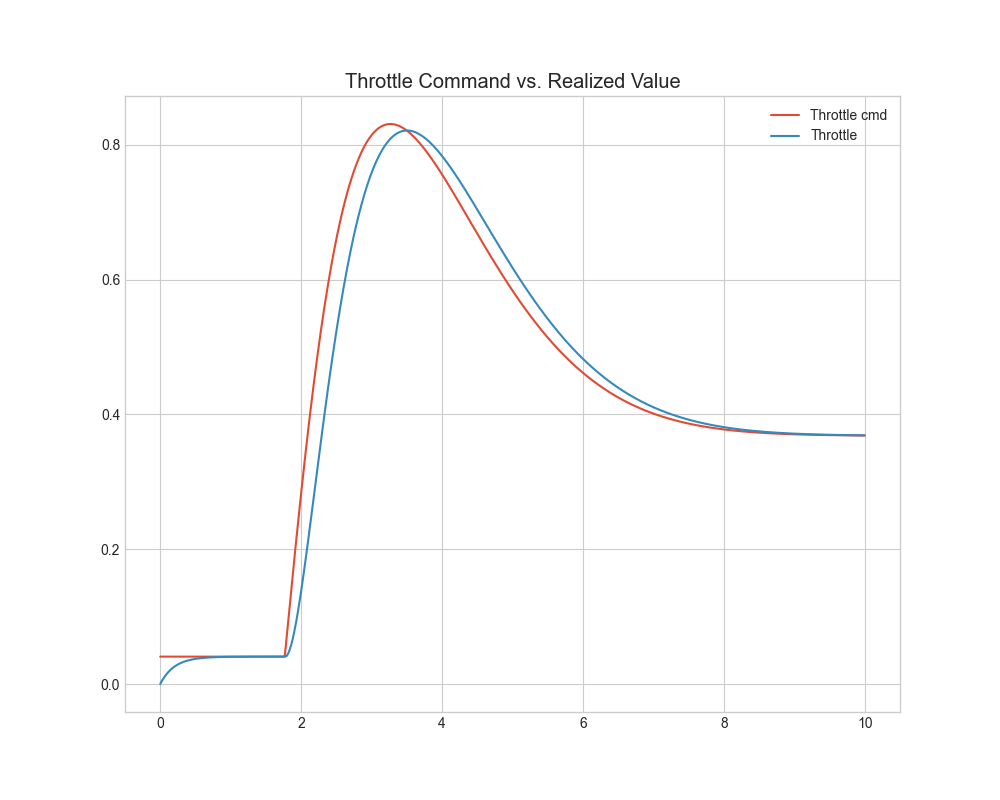

# 6-DOF Flight Dynamics Simulator with GNC

## Overview
A modular 6-DOF rigid-body flight simulator written in C++, featuring:
- quaternion-based attitude dynamics
- thrust vector control (pitch & yaw)
- actuator dynamics with rate limits
- variable mass and inertia
- gravity modeling
- aerodynamics modeling
- sensor modeling and state estimation
- closed-loop attitude control (GNC stack)

## Features
- 6-DOF rigid body simulation
- modular force/moment models (gravity, aero, propulsion)
- Runge-Kutta 4 integrator
- thrust vector control with gimbal actuators
- GNC stack:
    - EKF & dead reckoning navigation
    - attitude hold guidance
    - quaternion PD controller
    - landing guidance
    - inertial position/velocity PD controller
- accelerometer and gyroscope model

## Project Structure
- `sim_core`: simulation and GNC library
- `examples/`: runnable scenarios
- `tests/`: unit tests
- `docs/`: design and validation notes

## Example Scenarios
- `landing`: controlled vertical landing
- `IMU_simple_thrust`: dead reckoning & thrust validation
- `EKF_inertial_coords`: EKF validation
- `attitude_hold`: closed-loop attitude stabilization

## Controlled Landing Example

The simulator includes:

- IMU + GPS navigation
- Extended Kalman Filter state estimation
- PD translational guidance
- Thrust-vector-control attitude stabilization
- Actuator lag and rate limits

### Landing Trajectory

Vehicle starts with lateral offset and descending velocity. The controller reduces touchdown speed while steering toward the landing site.

A breakdown of the individual position and velocity components is shown below. The dotted vertical line represents the touchdown time. 

The zoomed-in, coordinate-separated plots show a tradeoff between lateral landing speed and xy-accuracy. The grid search used for gain tuning is likely not 
directed enough to jointly minimize these two. A choice has been made here to opt for soft landing.

Gimbal commands remain small, and a small delay can be seen between in the commands and the outputs.

The throttle is defined to be between 0 and 1. The throttle command never exceeds 1 and therefore never gets clipped. A delay can be seen between the command and output.

## Future Work
- improve landing accuracy
- trajectory guidance

**Author**:
Ashton Lowenstein